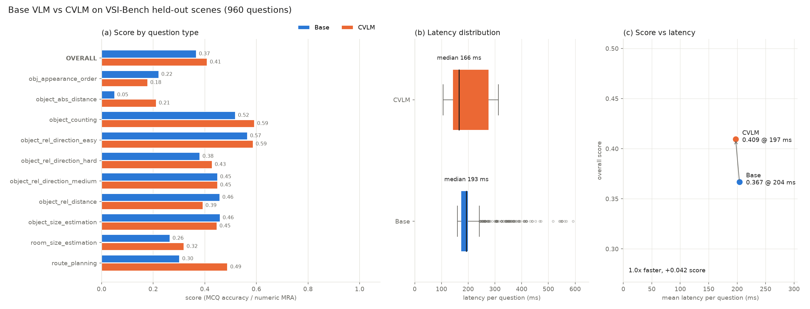
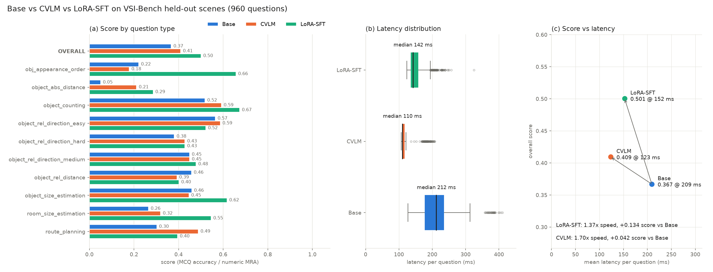

# Spatial_CLM
A repo for testing effectiveness of CLM/CVLM in spatial reasoning

**CVLM** (contrastive VLM) answers VSI-Bench video questions without generating
text. A frozen VLM (`Qwen/Qwen3.5-0.8B`) encodes both the video with its
question and a short text form of each possible answer, such as
`object_rel_direction_hard = back-left`. Two small trained heads (1.3M
parameters) map both into a shared space, and the closest answer wins.
Baselines are the same VLM generating the answer itself, zero-shot (**Base**)
or fine-tuned with LoRA (**LoRA-SFT**).

This plot comes from one run with seed 42, on the 960 questions from the 57
held-out scenes. Both models see the same 16 frames at 448px, on an RTX 3090.
The CVLM scores **0.409 vs 0.367** for Base, the mean of the per-question-type
scores (accuracy for multiple choice, MRA for numeric). Its mean latency is
about the same (**197 vs 204 ms**) because reading the ~1.5k video tokens
dominates both. Base generates only about 5 answer tokens, so skipping
generation saves little.

### With the LoRA-SFT baseline

This uses the same 960 held-out questions. Scores are the mean of the
per-question-type scores; latency is the mean per question.

| | Base | CVLM | LoRA-SFT |
|---|---|---|---|
| Overall score | 0.367 | 0.409 | **0.501** |
| Mean latency | 209 ms | **123 ms** | 152 ms |
| Trained parameters | – | 1.3M (heads) | 10.8M (LoRA, r=16) |

- **LoRA-SFT scores highest.** The biggest gains over the CVLM are on appearance
  order (0.66 vs 0.18), room size (0.55 vs 0.32) and object size (0.62 vs 0.45).
  The CVLM is better on route planning (0.49 vs 0.40).
- **The CVLM is fastest** because it runs one forward pass with no generation.
  Base and LoRA-SFT each generate about 3 tokens.
- **Training differs:** LoRA-SFT was trained with `--augment 4` and the CVLM
  without augmentation. SFT picked its best epoch on 240 held-out questions, the
  CVLM on all 960.
- **Latency is approximate:** Base and LoRA-SFT have the same architecture and
  generate similar numbers of tokens, yet differ by about 57 ms. That points to
  varying GPU load between the runs rather than a real model difference.

Details, equations and commands are in [src/README.md](src/README.md).

> VSI-Bench is an evaluation benchmark. These models are trained on a scene
> split of it, so the numbers are not untouched VSI-Bench results.
